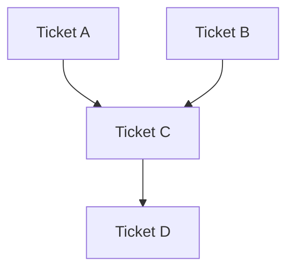

# Ticket Breakdown

## Workflow

1. Infer the area to prioritize from the user request.
2. Review specs:
   - Epic Brief
   - Core Flows
   - Tech Plan
3. Identify natural work units.
4. Apply judgment to group work by component, layer, or flow.
5. Prefer coarse, story-sized tickets over many small tickets.
6. Present the proposed breakdown and dependency diagram.
7. Iterate based on user feedback.

## Ticket Design Guidance

Prefer:

- Grouping by component or layer, not individual function.
- Grouping by flow, not individual step.
- Minimal least set of meaningful tickets.
- Tickets that can be implemented and validated independently.

Avoid:

- Over-breaking work into tiny mechanical tasks.
- Creating tickets without clear spec references.
- Hiding dependencies.
- Mixing unrelated concerns in one ticket.

## Ticket Format

For each ticket include:

- **Title**: Action-oriented.
- **Scope**: Included work and explicitly out-of-scope work.
- **Spec references**: Relevant Epic Brief, Core Flows, and Tech Plan sections.
- **Dependencies**: What must happen first, if anything.

## Dependency Diagram

Include a Mermaid diagram that shows dependency relationships.

Example:

## Refinement Options

After presenting tickets, offer relevant refinement options:

- Combine related work.
- Split tickets for parallelism or clarity.
- Reorganize dependencies.
- Change grouping approach by component, layer, or flow.

Iterate until the user confirms the breakdown is right.
