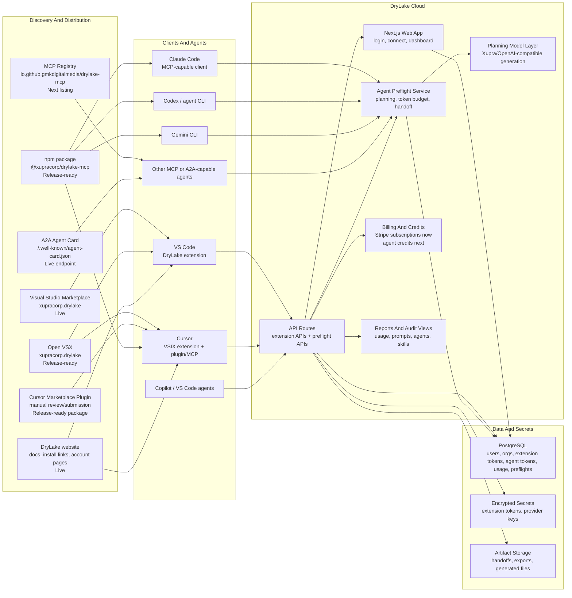
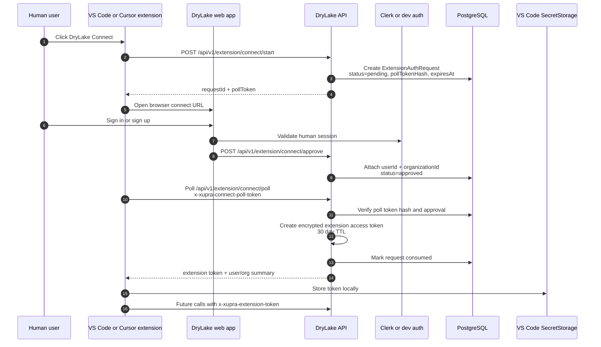
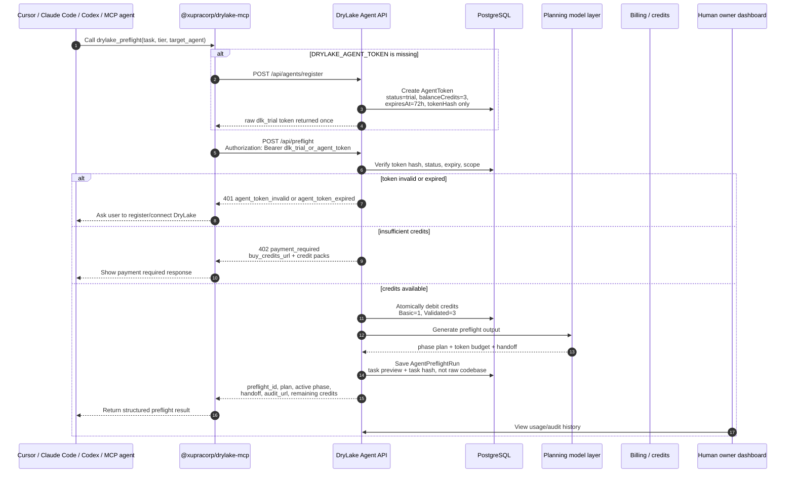
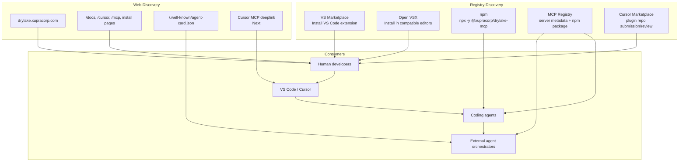
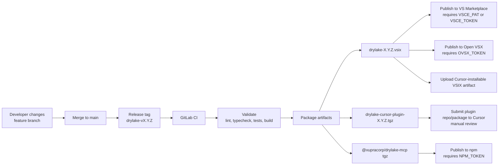
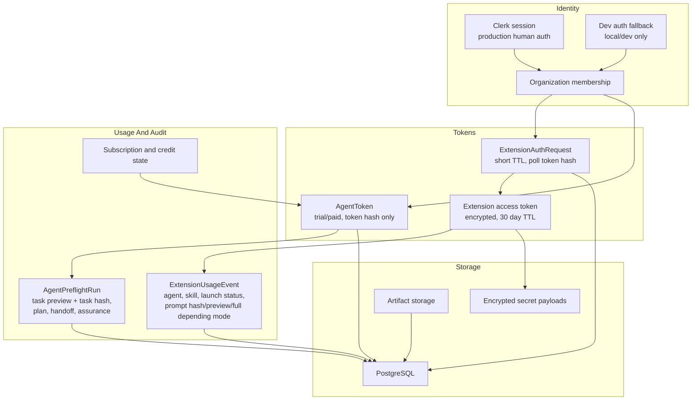

# DryLake Agent Platform Architecture

This document shows how the DryLake VS Code extension, website, MCP package, Agent Preflight API, authentication, billing, and discovery surfaces fit together.

Legend:

- **Live**: implemented in the current platform or current branch.
- **Release-ready**: packaged/automated but still requires registry credentials or marketplace review.
- **Next**: planned product layer after the current MCP/preflight foundation.

## 1. System Context

## 2. Human User Authentication And Extension Connect

This is the normal VS Code/Cursor extension path. A human signs in to DryLake, then the editor receives an encrypted extension access token.

Key properties:

- The browser connect request expires after a short TTL.
- The extension poll token is hashed in the database.
- The extension access token is encrypted and expires after 30 days.
- Future planning, usage, reporting, and handoff APIs require the extension token.
- Signed-out users should be blocked in the editor before planning or handoff work starts.

## 3. Agent Preflight MCP Authentication And Credit Flow

This is the new agent-facing path. Coding agents call DryLake before coding. DryLake returns a structured plan, token budget, next-phase contract, and handoff.

Key properties:

- Trial agent tokens are anonymous, short-lived, and limited.
- Raw agent tokens are returned once; only token hashes are stored.
- Trial agents do not get external integrations.
- DryLake stores a task preview and task hash, not full source code by default.
- Basic Preflight is 1 credit; Validated Preflight is 3 credits.
- Owner/team attachment, credit checkout, and richer audit dashboards are the next paid layer.

## 4. Discovery Surfaces

Other systems can discover DryLake through five paths:

Discovery details:

| Surface | What discovers DryLake | Current state | Purpose |
|---|---|---:|---|
| Visual Studio Marketplace | VS Code users | Live | Primary extension distribution |
| Open VSX | Cursor/VSCodium/Kiro/compatible editors | Release-ready | Same VSIX outside Microsoft Marketplace |
| Cursor Marketplace | Cursor users and Cursor agents | Package ready, manual review needed | Plugin with MCP config, rule, and skill |
| npm | MCP-capable agents | Package ready | `npx -y @xupracorp/drylake-mcp` |
| MCP Registry | MCP clients and directories | Next listing | Standard MCP server discovery |
| A2A Agent Card | Agent-to-agent discovery systems | Live endpoint | Advertise planning/preflight skills |
| DryLake website | Humans, search, docs, install pages | Live | Conversion, account, install, billing |

## 5. Release Architecture

One source build should produce the same extension across all editor platforms.

Release invariants:

- `publisher` must stay `xupracorp`.
- extension `name` must stay `drylake`.
- Marketplace ID stays `xupracorp.drylake`.
- Cursor plugin version should match the extension version.
- MCP package can version independently, but release checks must verify package name and MCP metadata.
- Tag releases should fail if required publish tokens are missing, instead of silently skipping platforms.

## 6. Data Ownership And Security Model

Security rules:

- Human/product use is organization-scoped.
- Extension calls use `x-xupra-extension-token`.
- Agent Preflight calls use `Authorization: Bearer dlk_*`.
- Secret values and extension tokens must never be logged.
- Prompt capture is controlled by `EXTENSION_PROMPT_CAPTURE_MODE`.
- Trial agent tokens are limited and should not unlock integrations or long-term audit history.
- Write-capable integrations should stay behind explicit owner approval and scoped permissions.

## 7. Target End State

DryLake becomes the planning control plane for coding agents:

1. Humans discover DryLake through VS Marketplace, Open VSX, Cursor Marketplace, website, or search.
2. Editors install the same DryLake extension artifact.
3. Agents discover DryLake through MCP Registry, npm, Cursor plugin config, or A2A Agent Card.
4. Humans authenticate through the website and connect their editor.
5. Agents authenticate with short-lived trial tokens or owner-created paid agent tokens.
6. DryLake sells planning/preflight tasks:
   - Basic Preflight: phase plan, token budget, focused handoff.
   - Validated Preflight: Basic plus risk, tests, rollback, dependency impact, validation.
   - Team workspace: saved history, owner visibility, policy, audit, billing, and assurance reporting.
