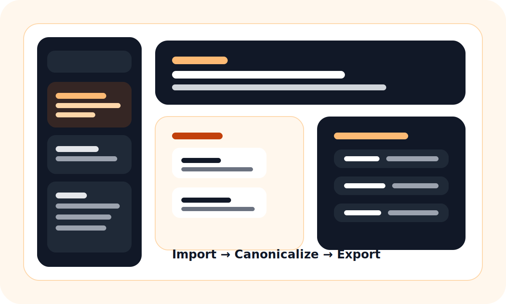
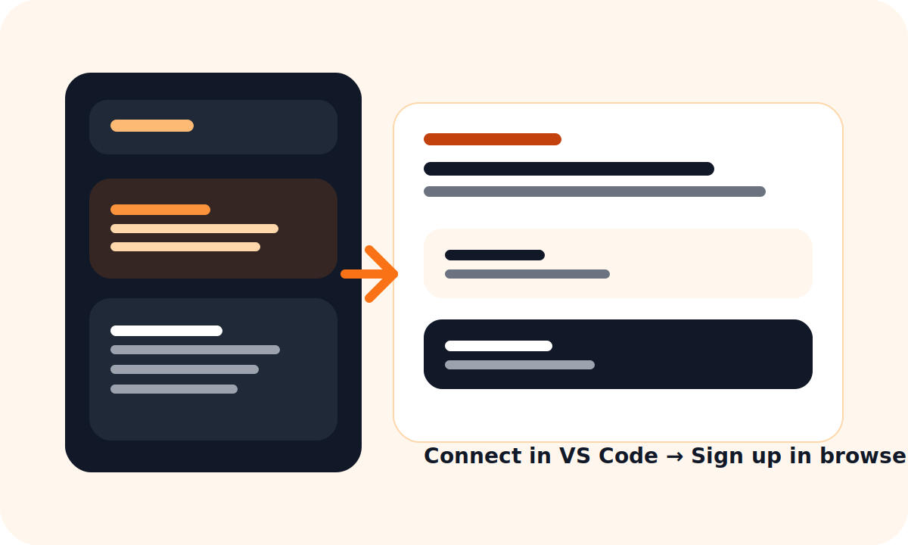

# Xupra DryLake for VS Code

Move agents, skills, rules, and configs between Codex, Claude Code, Cursor, and Claude Agents without rebuilding them by hand.

Install the extension, click Connect, sign up in the browser, and return straight to VS Code or Cursor with default agent files ready to scan.



## What Xupra does

Xupra DryLake is an extension-first workflow for agent portability.

From VS Code or Cursor, the extension can:

- connect your editor to your Xupra workspace
- detect default agent files automatically
- import repo files into a canonical package
- check compatibility for a target platform
- generate export previews
- pull generated files back into the repo
- trigger deployment jobs when a target is ready

## Default file discovery

The extension scans the default locations automatically, including:

- `AGENTS.md`
- `CLAUDE.md`
- `.agents/skills/**/SKILL.md`
- `.codex/agents/*.toml`
- `.claude/skills/**/SKILL.md`
- `.claude/agents/**/*.md`
- `.cursor/skills/**/SKILL.md`
- `.cursor/rules/**/*.mdc`

It also scans loose `*.md` and `*.py` files.

If your repo uses custom locations, add glob patterns in:

- `xupra.additionalScanPatterns`

## Customer flow



1. Install the extension from the Marketplace or a `.vsix`.
2. Run `Xupra DryLake: Connect`.
3. The extension opens your browser.
4. Sign up or sign in to Xupra.
5. Xupra creates your workspace and returns directly to VS Code or Cursor.
6. Scan, import, and continue in the editor.

Manual token fallback still exists, but it is only for cases where the browser handoff fails.

## Commands

- `Xupra DryLake: Connect`
- `Xupra DryLake: Scan Workspace`
- `Xupra DryLake: Import Workspace`
- `Xupra DryLake: Check Compatibility`
- `Xupra DryLake: Export Preview`
- `Xupra DryLake: Pull Package Files`
- `Xupra DryLake: Deploy`

## Settings

Key settings:

- `xupra.baseUrl`
- `xupra.additionalScanPatterns`
- `xupra.defaultTargetPlatform`
- `xupra.confirmBeforeWriteback`
- `xupra.pullGeneratedFilesAfterExport`
- `xupra.openDashboardAfterConnect`

If you tested an older build that pointed to `52.196.86.96`, change `xupra.baseUrl` back to:

- `https://drylake.xupracorp.com`

## Local testing

1. Open `extensions/xupra-drylake-vscode` in VS Code.
2. Run `npm install`.
3. Press `F5`.
4. Choose `Run Xupra Extension`.
5. In the Extension Development Host, open the `Xupra` activity bar.
6. Set `xupra.baseUrl`:
   - staging: `https://drylake.xupracorp.com`
   - local override only when you are intentionally testing local development: `http://localhost:3005`

## Package for install testing

```bash
npm run package:vsix
```

Then install with:

- `Extensions: Install from VSIX...`

## Quick local update (no manual uninstall needed)

From `extensions/xupra-drylake-vscode` run:

```bash
npm run reinstall:vsix
```

This packages the latest VSIX and force-installs it over the current install.

Then in VS Code run:

- `Developer: Reload Window`

## Uninstall options

From `extensions/xupra-drylake-vscode` run:

```bash
npm run uninstall:vscode
```

Or in VS Code:

- Open Extensions panel
- Search `xupra.drylake`
- Click the gear icon and choose `Uninstall`

## Cursor compatibility

The extension stays within standard VS Code APIs.

```bash
npm run check:cursor
```
