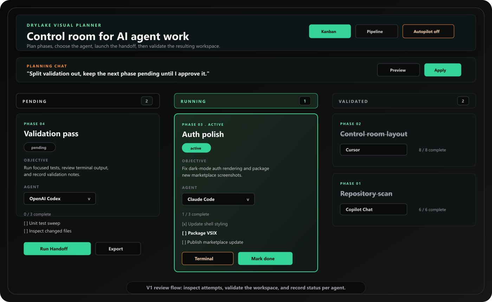
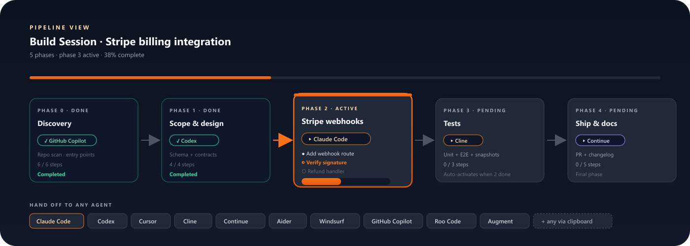

# DryLake — Visual Planning for AI Coding Agents

**Visual planning for AI coding work.** Drop in a ticket, split it into phases, assign an agent, and run each phase from Kanban or Pipeline.

Assign phases to **Claude Code · OpenAI Codex · Cursor · Cline · Continue · Aider · Windsurf · GitHub Copilot · Roo Code · Augment Code** from the planner. DryLake prepares the phase prompt and runs the configured launcher when available, with clipboard export as a fallback.

## What It Does

- **Plans your work as a kanban.** Pending → Active → Validating → Done. Drag phases to reorder them.
- **One agent per phase.** Pick Claude Code for design, Cline for tests, Codex for docs — whatever you like.
- **One-click phase run.** Click *Run with agent* on a phase and DryLake starts the configured launcher when available.
- **Auto-advance.** Tick all steps in a phase, DryLake completes it and activates the next one.
- **Planning chat.** Tell DryLake to add a step or change scope; the kanban updates live.

## Get Started In 30 Seconds

1. Install DryLake from the VS Code Marketplace.
2. Run `DryLake: Start Build Session`.
3. Paste a ticket, bug report, feature request, or product spec.
4. Review the kanban DryLake creates.
5. Click *Run with agent* on the active phase.
6. Tick steps off as the agent finishes them. Next phase auto-activates.

## Works With Your Coding Agents

Pick a different agent per phase — or stick with one for the whole session. DryLake supports configured launchers and prompt export for:

1. **Claude Code** (Anthropic)
2. **OpenAI Codex**
3. **Cursor**
4. **Cline** (formerly Claude Dev)
5. **Continue.dev**
6. **Aider**
7. **Windsurf** (Codeium)
8. **GitHub Copilot** (incl. Copilot Chat & agent mode)
9. **Roo Code** (Roo Cline)
10. **Augment Code**

Plus **External AI Prompt** mode for ChatGPT, Gemini, DeepSeek, Tabnine, Cody, Plandex, Devin, Blackbox, Traycer, Zed, Replit, Trae, or any other tool outside the listed agents.

## Support

- Homepage: <https://drylake.xupracorp.com/>
- About Xupra: <https://drylake.xupracorp.com/about>
- Support: support@xupracorp.com

## Non-affiliation

DryLake is not affiliated with Anthropic, OpenAI, GitHub, Microsoft, Cursor, Cline, Continue, Aider, Codeium / Windsurf, Roo, Augment, Tabnine, Sourcegraph / Cody, Plandex, Cognition / Devin, Blackbox, Traycer, Zencoder, Zed, Replit, Trae, Google, DeepSeek, or their respective owners.
